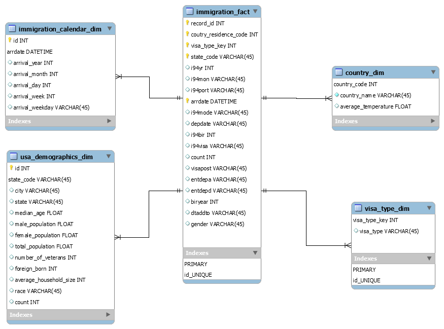

# Data Engineering Capstone Project

## Project Summary
The purpose of the capstone project for data engineering is to enable students to integrate the knowledge and skills they have gained throughout the program. It is a significant component of a learner's portfolio that will contribute to achieving their career objectives in the field of data engineering. The primary objective of the project was to create an ETL pipeline for combining I94 immigration, global land temperatures, and US demographics datasets into an analytics database to analyze immigration events. The resulting analytics database can be used to identify immigration patterns to the US, such as whether people from countries with warmer or colder climates tend to immigrate to the US in greater numbers.

## Data and Code
All the data for this project was loaded into S3 prior to commencing the project. The exception is the i94res.csv file which was loaded into Amazon EMR hdfs filesystem. 

In addition to the data files, the project workspace includes:
* **etl.py** - reads data from S3, processes that data using Spark, and writes processed data as a set of dimensional tables back to S3
* **etl_functions.py and utility.py** - these modules contains the functions for creating fact and dimension tables, data visualizations and cleaning. 
* **config.cfg** - contains configuration that allows the ETL pipeline to access AWS EMR cluster. 
* **Jupyter Notebooks** - jupyter notebook that was used for building the ETL pipeline.

## Prerequisites
* AWS EMR cluster
* Apache Spark
* configparser
python 3 is needed to run the python scripts.

### The project follows the following steps:
* Step 1: Scope the Project and Gather Data
* Step 2: Explore and Assess the Data
* Step 3: Define the Data Model
* Step 4: Run ETL to Model the Data
* Step 5: Complete Project Write Up

## Step 1: Scope the Project and Gather Data
### Project Scope
The analytics database creation process involves several steps, including:

- Using Spark to load the datasets into dataframes.
- Conducting exploratory data analysis on the I94 immigration, demographics, and global land temperatures datasets to identify missing values and develop strategies for data cleaning.
- Performing data cleaning functions on all datasets.

Creating dimension tables, including:
- The immigration calendar dimension table, which is created from the I94 immigration dataset and linked to the fact table through the arrdate field.
- The country dimension table, which is created from the I94 immigration and global temperatures datasets and linked to the fact table through the country of residence code, allowing analysts to explore correlations between climate and immigration to US states.
- The USA demographics dimension table, which is created from the US cities demographics data and linked to the fact table through the state code field.
- Creating the fact table from the cleaned I94 immigration dataset and the visa_type dimension.

Amazon S3 and Apache Spark are the technologies used in this project. The data will be read and staged from the customer's repository using Spark. Although the project is implemented on this notebook, provisions have been made to run the ETL on a spark cluster through the etl.py script. This script reads data from S3 and creates fact and dimension tables through Spark, which are then loaded back into S3.
## Step 2: Explore and Assess the Data
> Refer to the jupyter notebook Step 2

## Step 3: Define the Data Model
### 3.1 Conceptual Data Model

The country dimension table is comprised of data from two datasets: the global land temperatures by city and the immigration datasets. This combination of data enables analysts to investigate the correlations between global land temperatures and immigration patterns to the US.

The US demographics dimension table is sourced from the demographics dataset and is linked to the immigration fact table at the US state level. This dimension allows analysts to gain insights into migration patterns based on demographics and overall population of states. For example, one could explore if more visitors come to populous states on a monthly basis. By leveraging this data model, a dashboard can be created that offers granular information on visits to the US, potentially driving data-driven decision making within the tourism and immigration departments at the state level.

The visa type dimension table is sourced from the immigration datasets and is linked to the immigration fact table via the visa_type_key.

The immigration fact table is the centerpiece of the data model. It's comprised of data from the immigration datasets and contains keys that link to the dimension tables. Detailed information on the data that makes up the fact table can be found in the data dictionary of the immigration dataset.

### 3.2 Mapping Out Data Pipelines
The pipeline steps are as follows:
* Load the datasets
* Clean the I94 Immigration data to create Spark dataframe for each month
* Create visa_type dimension table
* Create calendar dimension table
* Extract clean global temperatures data
* Create country dimension table
* Create immigration fact table
* Load demographics data
* Clean demographics data
* Create demographic dimension table

## Step 4: Run Pipelines to Model the Data 
### 4.1 Create the data model
> Refere to the jupyter notebook for the data dictionary.

### 4.2 Running the ETL pipeline
The ETL pipeline is defined in the etl.py script, and this script uses the utility.py and etl_functions.py modules to create a pipeline that creates final tables in Amazon S3.
> spark-submit --packages saurfang:spark-sas7bdat:2.0.0-s_2.10 etl.py 

